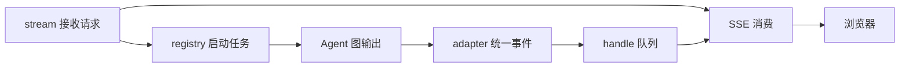

# Part 01 一次聊天运行如何串起来

## 学习目标

能解释一次聊天请求从进入 API 到浏览器收到 done 的过程，尤其理解后台执行和 SSE 消费之间的关系。暂时不展开审批、技能和模型 SDK。

## 机制解释

chat.py 是运行协调层。它确定调用者、管理本次执行、转发事件、保存结果；真正的推理和工具调度交给 Agent 图。长文件包含入口、恢复、查询、取消和辅助函数，不代表一次请求按文件顺序执行全部代码。

thread_id 标识一段对话；run_id 标识一次执行；request_id 标识客户端的一次请求及其网络重试。用户批准后恢复也会启动新的 run，但继续原 thread 的 checkpoint。三个 ID 不能互换。

正常路径是：校验身份和消息 → 确认 thread → 预占请求并识别重复 → 取得运行句柄 → 保存 running 和用户消息 → 启动运行任务并返回 SSE 响应。重复请求返回原 run 信息，不重新推理。

最重要的连接是一个队列：registry.attach 启动受管理任务，_run_turn 执行图并向 handle.publish 放事件；_sse_response 从 handle.drain 取事件，把它们编码为 SSE 发给浏览器。生产者和消费者并行，不是等 Agent 全部完成再一次返回。浏览器断线不会自动取消 registry 持有的任务。

_run_turn 分准备、执行、收尾三段。准备取得用户图、配置预算和运行证据；执行遍历 astream，经 adapter 转换出 token、tool_result、interrupt 等事件；收尾判断 completed/interrupted/failed/cancelled，保存回答和运行状态，释放活动运行，再发送 done。先保存状态再 done，避免浏览器立即刷新时读到旧的 running。

_setup_call 将同步准备操作交给线程，等待期间检查取消；外层 asyncio.timeout 约束受保护阶段。取消等待不能杀死已运行线程，迟到结果被丢弃，已发生的写入不自动撤销。预算超时也不等于所有同步 SDK 操作立刻停止。

## 代码阅读

先读 [chat.py](../../src/api_view/api/chat.py) 的 stream、_run_turn、_sse_response，顺序也按这三个走。只画它们之间的数据箭头。第二遍读 [run_registry.py](../../src/api_view/run_registry.py) 的 attach、publish、drain、release；最后才读 [stream_adapter.py](../../src/api_view/stream_adapter.py) 的 consume 和 finish。

本章暂时跳过 _record_interrupt、_decide、偏好字段解析和工具内容解析。看见它们时只标注“保存中断”“处理用户决策”“处理记忆”。

## 具体案例

用户发送“你好”。服务端保存用户消息，启动 run，发 run_started。图产生文字块，adapter 转为 token，队列送给 SSE。正常完成后保存回答和 completed，再发 done。若图初始化抛错，应该发 error 并保存 failed，不能只关流还留下 running。

证据入口：[T13](../../tests/acceptance/test_t13.py) 的 HTTP/SSE 用例及 [T34](../../tests/acceptance/test_t34.py) 的初始化失败、取消和超时用例。阅读断言，不必为了阅读启动全套服务。

## 自检

1. _run_turn 与 _sse_response 谁生产事件，谁消费？
2. 为什么断开网页和取消运行不是同一件事？
3. 为什么 done 之前要保存最终状态并释放 registry？
4. _setup_call 超时后，工作线程一定停止了吗？

核对要点：队列连接生产消费；断线只影响消费者；done 后刷新应见终态；线程无法强杀，不能宣称撤销已发生操作。

## 面试表达

“API 为每次聊天建立受管理的运行任务。图输出被转换为统一事件，通过队列发送给 SSE；最终状态先落库，再通知前端。我们还处理请求重放、取消和初始化失败的终态。”只有理解并核对过后才使用这段表达。

## 确认

在 PROGRESS 写下你自己的五步流程，并说明队列处为什么分成两条路径。剩余疑问写明具体函数；不需要逐行复述。
