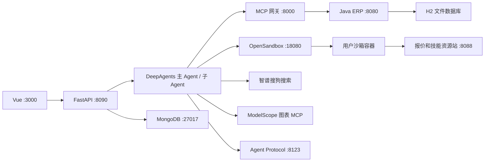

# 架构与实现边界

## 技术与职责



课程的 Java ERP 与 OpenSandbox 都用 8080，本地部署仅改变 OpenSandbox 宿主映射到 18080，容器内部按 SDK 配置，不替换技术。

Java 补齐方案：Java 21、Spring Boot 3.5 系列、Maven Wrapper、Spring Web、Validation、JDBC 事务、H2 文件库。讲义未给 Java 内部代码/数据库，选最小单体；不引入 Spring AI、微服务或消息总线。数据库文件挂持久卷，不能用 `jdbc:h2:mem:` 验收重启持久化。精确版本由 T00 核验锁定。

## 目录合同

```text
erp/                         Java 工程、mvnw、SQL、测试、Dockerfile
frontend/                    Vue 3 + TypeScript + Vite、浏览器测试
src/api_view/                web_main.py、agent_loader.py、api/chat.py、history.py
src/agent/                   main_agent.py、config.py、schema.py、日志
src/agent/memory/            课程运行时 AGENTS.md、prompts.py
src/agent/subagents/         loader.py、configs/*.yaml、异步分析图
src/agent/middlewares/       沙箱、上下文、技能同步、记忆、熔断和限制
src/agent/backends/          manager、setup、OpenSandbox 适配、proxy
src/agent/tools/             MCP 客户端、搜索、图表、技能、下载、HITL
src/mcp_server/              server_main.py、http_base.py、tools/
src/skills/                  main/skill-management、procurement/*
fixtures/                   种子 JSON、报价输入、技能包源文件
infra/                      Compose、OpenSandbox 配置、沙箱镜像说明
tests/                      unit、contract、integration、live、fixtures
scripts/                    doctor、gate、seed/reset、demo、方案检查工具
docs/runtime/               实际版本、运行手册、学习说明
artifacts/                  验收证据，不存密钥
download/                   按用户隔离的报告文件
pyproject.toml、uv.lock      Python 包和锁
langgraph.json              异步 Agent Protocol 服务配置
```

根 `AGENTS.md` 指导编码模型；`src/agent/memory/AGENTS.md` 指导采购助手，二者不得互相注入。

## 数据所有权

| 数据 | 唯一事实源 | 其他层职责 |
|---|---|---|
| 供应商、物料、库存、订单 | Java 数据库 | MCP 代理，Agent 通过工具访问 |
| 图执行状态、中断位置 | MongoDB Checkpointer | API 查询 checkpoint，不手造恢复状态 |
| 偏好、持久技能文件 | MongoDB-backed LangGraph Store | 沙箱是执行副本 |
| 会话归属、展示消息、运行 | 应用 MongoDB 集合 | Vue 读取，不以浏览器内存作为事实源 |
| 下载文件 | 应用 MongoDB 元数据 + 文件卷 | 按 artifact_id 获取，不暴露任意宿主路径 |
| 演示报价 | 自建报价站 | 抓取保留来源与时间，标明演示数据 |

## Agent 组织

主 Agent 管理任务清单、分派、汇总。`procurement-analyst` 有查询、搜索、图表、文件和分析技能；`procurement-order` 有查询、补充信息、订单创建修改。审批在写工具执行边界发生，不仅写进提示词。

保留 YAML 加载与课程名称模式解析；配置同时列出预期完整工具集合，空匹配或多匹配越权直接启动失败。工具目录升级后审阅快照，不任由子串匹配扩大权限。

同步子 Agent 每次委派独立消息上下文，其文件后端可共享用户沙箱；上下文隔离不等于文件隔离。异步分析使用 Agent Protocol 服务，不能把 `asyncio.create_task` 当成课程异步能力。

## 并发与恢复

Demo 单 FastAPI worker。一个 thread 最多一个活动 run；一个用户沙箱最多一个执行租约；不同用户可并发。`user_id` 来自服务端上下文，不让模型填写。

固定 `demo-a`、`demo-b` 演示账号，由服务端建立 HttpOnly Cookie，仅用于本机身份切换，不声称是生产认证。会话、checkpoint、技能和下载必须检查归属。

可以缓存已编译图，但全局单例不得保存可变的“当前用户 backend”。每次运行注入只读用户上下文，选择作用域内 proxy 和 Store namespace。

请求使用 request_id 去重；订单使用服务端稳定操作 ID 保证重放不重复写；同一 run 的中断恢复用条件更新。先采用明确有限状态，不构建通用工作流平台。
